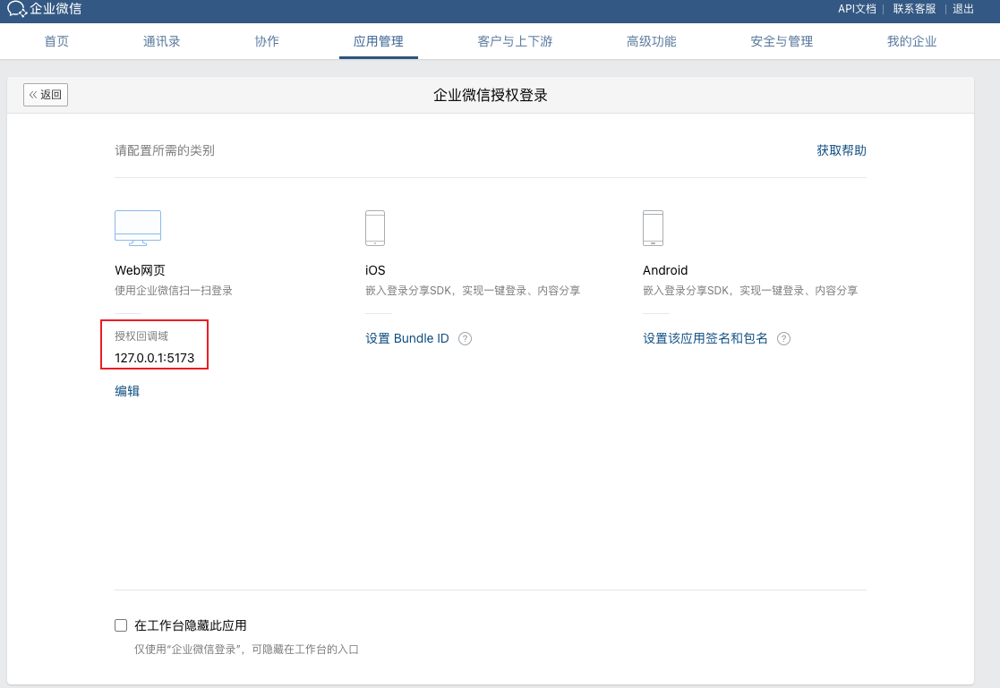
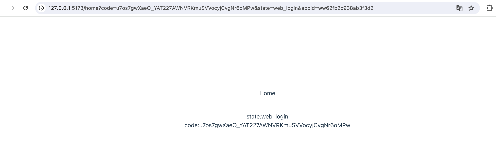
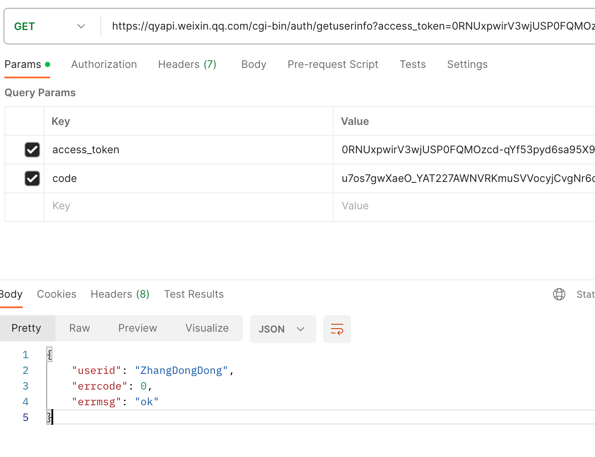

# 企业微信扫码登录（企业内部应用）

> **步骤**
>
> - 构造二维码链接进行展示二维码
>
>   - 建议调用后端接口获取链接，链接样式如下
>
>   - ```tsx
>     qr_code_url='https://open.work.weixin.qq.com/wwopen/sso/qrConnect?appid=xxx&agentid=xxx&redirect_uri=http%3A%2F%2F127.0.0.1%3A5173%2Fhome&state=web_login'
>     ```
>
> - 手机端扫码&确认登陆
>
> - 携带参数跳转到重定向url
>
>   - 重定向后的结果样式如下
>   - http://127.0.0.1:5173/home?code=u7os7gwXaeO_YAT227AWNVRKmuSVVocyjCvgNr6oMPw&state=web_login&appid=ww62fb2c938ab3f3d2
>
> - 调用后端接口进行用户登陆身份验证


## 构造登陆二维码

```vue
<script setup lang="ts">
const appid=''
const agentid=''
const redirect_uri='http%3A%2F%2F127.0.0.1%3A5173%2Fhome'

const qr_code_url=`https://open.work.weixin.qq.com/wwopen/sso/qrConnect?appid=${appid}&agentid=${agentid}&redirect_uri=${redirect_uri}&state=web_login`
</script>

<template>
      <div>
        <iframe  style="height: 380px; text-align: center;" :src="qr_code_url" frameborder="0"></iframe>
      </div>
</template>

<style scoped>

</style>

```

开发者需要构造如下的链接来获取 `code` 参数。建议调用后端接口获取

> https://login.work.weixin.qq.com/wwlogin/sso/login?login_type=LOGIN_TYPE&appid=APPID&redirect_uri=REDIRECT_URI&state=STATE

### 参数说明

| 参数名       | 类型   | 必填 | 说明                                                         |
| ------------ | ------ | ---- | ------------------------------------------------------------ |
| login_type   | string | 是   | 登录类型。 `ServiceApp`：服务商登录；`CorpApp`：企业自建/代开发应用登录。 |
| appid        | string | 是   | 登录类型为企业自建应用/服务商代开发应用时填企业 `CorpID`，第三方登录时填[登录授权 SuiteID](https://developer.work.weixin.qq.com/document/path/98152#45846/开启网页授权登录) |
| agentid      | string | 否   | 企业自建应用/服务商代开发应用 `AgentID`，当`login_type=CorpApp`时填写 |
| redirect_uri | string | 是   | 登录成功重定向 `url`，需进行 `URLEncode` 注意域名必须配置为可信域名，详见下文的“redirect_uri域名说明” |
| state        | string | 否   | 登录 `state` 用于保持请求和回调的状态，授权请求后原样带回给企业。该参数可用于防止`CSRF` 攻击（跨站请求伪造攻击），建议带上该参数，可设置为简单的随机数加 `session` 进行校验 需进行 `URLEncode` |
| lang         | string | 否   | 语言类型。`zh`：中文；`en`：英文。                           |

**redirect_uri域名说明**

redirect_uri的域名必须配置为可信域名，不同应用类型的配置方法不同，具体如下

| 应用类型   | 域名配置方法                         |
| ---------- | ------------------------------------ |
| 自建应用   | OAuth可信域名或者Web网页授权回调域名 |
| 代开发应用 | OAuth可信域名或者Web网页授权回调域名 |
| 第三方应用 | “登录授权”的可信域名                 |




## 跳转到重定向url

```vue
<script setup lang="ts">

import {onMounted, reactive} from "vue";
import {useRoute} from "vue-router";

interface QRLoginParam{
  state:string,
  code:string
}

const state=reactive<{loginParam:QRLoginParam}>({
  loginParam:{
    state:'',
    code:''
  }
})

onMounted(()=>{
  let route = useRoute();
  console.log(route.query.code)
  console.log(route.query.state)
  state.loginParam.code=route.query.code
  state.loginParam.state=route.query.state
})

</script>

<template>
  <div>
    <p>Home</p>
    <br>
    state:{{state.loginParam.state}}
    <br>
    code:{{state.loginParam.code}}
  </div>
</template>

<style scoped>

</style>
```

手机端扫码确认后，就会携带参数自动跳转到配置的重定向地址，在这里即可获取参数信息。



## 验证登陆身份

使用用户登录成功颁发的`code`来获取成员信息。



